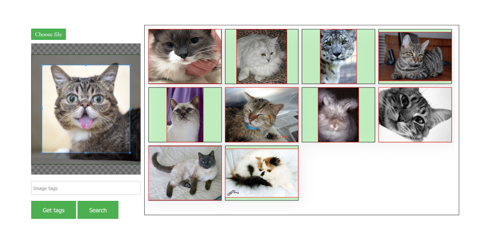

# Visual Search
A visual search engine based on Elasticsearch and Tensorflow (now fully dockerized
to run it in up-to-date development environments).




## Description

This repository contains code in `Python 2.7` and utilizes `Faster-RCNN` (with `VGG-16` as backbone)
implemented in `Tensorflow 0.12.1` to extract features from images. An
`Elasticsearch` instance is used to store feature vectors of the corresponding images,
along with a plugin to compute distance between them.

**TODO**: Replace the outdated `Faster-RCNN` with a faster and more
accurate model (suggestions or any collaboration is welcomed).

## Requirements

The setup assumes you have a running installation of
[nvidia-docker](https://github.com/NVIDIA/nvidia-docker) and driver version 367.48
or above.

## Setup Elasticsearch

First, we need to build the `Elasticsearch` plugin to compute distance between
feature vectors. Make sure that you have [Maven](https://maven.apache.org/) installed.

```bash
cd elasticsearch/es-plugin
mvn install
```
Next, we need to create a [docker network](https://docs.docker.com/engine/reference/commandline/network/)
so that all other containers can resolve the IP address of our `elasticsearch`
instance.

```bash
docker network create vs_es_net
```
Finally, start the `elasticsearch` container. It will automatically add the plugin, create a
[named docker volume](https://docs.docker.com/storage/volumes/) for persistent
storage and connect the container to the network we just created:

```bash
cd ../ && docker-compose up -d
```

## Index images

In order to populate the `elasticsearch` db with images, we need to first process
them with a feature extractor (`Faster-RCNN`). The `indexer` services
can do this for any image we place inside `visual_search/images`.

First we build a dockerized environment for the object detection model to run in:

```bash
cd visual_search && docker build --tag visual_search_env .
```
Here we use an earlier version implemented by [@Endernewton](https://github.com/endernewton).
To get pre-trained model, you can visit [release section](https://github.com/tuan3w/visual_search/releases),
download and extract file `model.tar.gz` to `visual_search/models/` folder. Optionally,
you can run:

```bash
mkdir models && cd models
curl https://github.com/tuan3w/visual_search/releases/download/v0.0.1/model.tar.gz
tar -xvf model.tar.gz
```

To index the desired images, copy the corresponding compose file to the proper
directory and start the indexing service:

```bash
cd ../ && cp indexer/docker-compose.yml .
docker-compose up
```

## Start server

Before starting the server, again copy the corresponding compose file (overwrite
the one used for indexing data) into the proper directory and start the containerized
`flask` server:

```bash
cp server/docker-compose.yml .
docker-compose up -d
```

 Now, you can access the link `http://localhost:5000/static/index.html` to test the search engine.

## LICENSE
[MIT](LICENSE)
